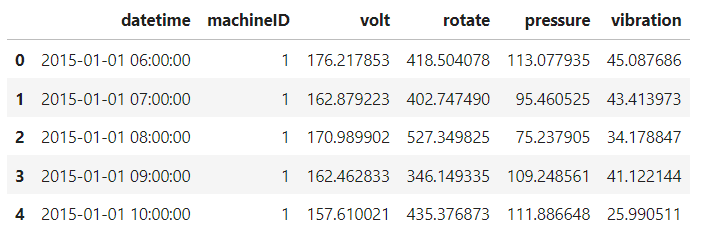
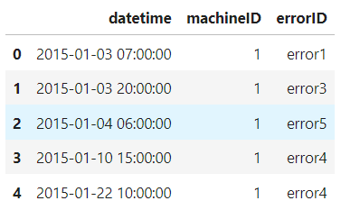
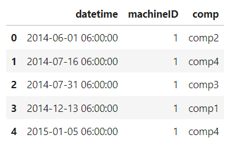
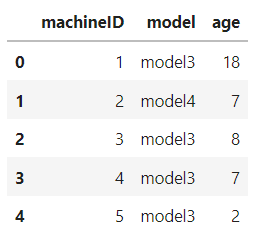
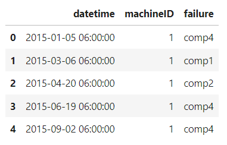
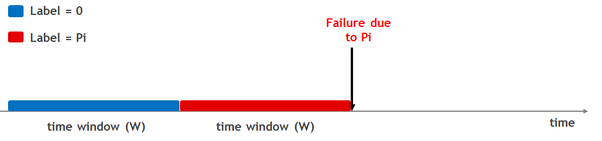
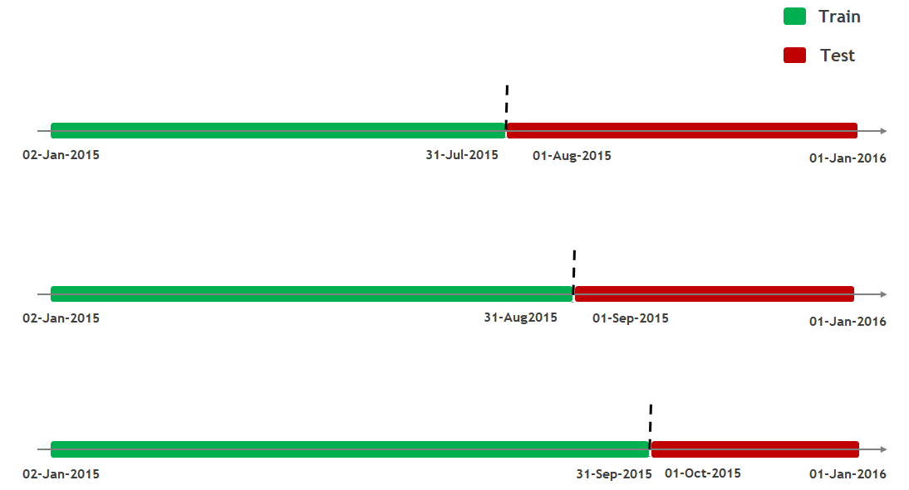
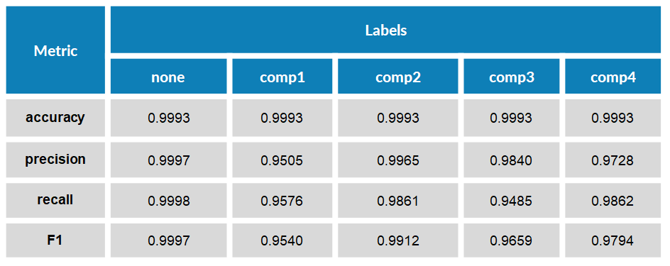

# Outline
  - [Problem Overview](#problem-overview)
  - [Dataset Descrption](#dataset-descrption)
  - [Feature Engineering](#feature-engineering)
  - [Label Construction](#label-construction)
  - [Training and Testing split](#training-and-testing-split)
  - [Results](#results)
  - [References](#references)

### Problem Overview

A business requires its equipments to be running at full utilization and maximum efficiency to achieve returns invested capital. They rely on corrective maintenance, where parts are replaced as and when they fail or preventive maintenance, where they determine the useful lifespan for a part, and maintain or replace it before a failure. Though corrective maintenance ensures parts are used completely without wasting component life, but it costs the business in downtime, labor, and unscheduled maintenance requirements such as off hours, or inconvenient locations. Preventive maintenance avoids unscheduled and catastrophic failures. But the high costs of scheduled downtime, under-utilization of the component during its useful lifetime, and labor still remain.

Predictive maintenance optimizes the balance between corrective and preventative maintenance, by enabling just in time replacement of components, therefore extending component lifespans and reducing unscheduled maintenance and labor costs, businesses can gain cost savings and competitive advantages.

### Dataset Descrption

**Telemetry dataset** 

Time-series data which consists of voltage, rotation, pressure, and vibration measurements collected from 100 machines in real time averaged over every hour collected during the year 2015. Total records 876,100.

**Errors dataset** 

Consists of error logs. These are non-breaking errors thrown while the machine is still operational and do not constitute as failures. The error date and times are rounded to the closest hour since the telemetry data is collected at an hourly rate. Total records 3,919.

**Maintenance dataset** 

These are the scheduled and unscheduled maintenance records which correspond to both regular inspection of components as well as failures. A record is generated if a component is replaced during the scheduled inspection or replaced due to a breakdown. Maintenance data has both 2014 and 2015 records. Total records 3,286.

**Machine dataset** 

These include descriptive information about the type of each machine and its age (number of years in service). Total machines 100.

**Failures dataset** 

These are the records of component replacements due to failures. Each record has a date and time, machine ID, and failed component type. Total records 761.

### Feature Engineering

This requires bringing the properties of different datasets together to create features that best describe a machines's health condition at a given point in time.

**Features from Telemetry**

Telemetry data almost always comes with time-stamps which makes it suitable for calculating lagging features (compute rolling aggregate measures such as mean, standard deviation, minimum, maximum, etc.) to represent the short term history of the telemetry over the lag window. We use rolling mean and standard deviation of the telemetry data over the last 3 hours and 24 hours.

**Features from Errors**

Like telemetry data, errors come with timestamps. An important difference is that the error IDs are categorical values and should not be averaged over time intervals like the telemetry measurements. Instead, we count the number of errors of each type in a lagging window. 

**Features from Maintenance logs**

We calculate how long it has been since a component is last replaced since it correlates with component failures, the longer a component is used, the more degradation should be expected.

**Features from Machines dataset**

The machine data can be used as features without further modification.

### Label Construction

We have to estimate the probability that a machine will fail in the next 24 hours due to a certain component failure (component 1, 2, 3, or 4). All records within a 24 hour window before a failure of a component will have failure=comp no. and all records not within 24 hours of a component failure have failure=none.

### Training and Testing split

Due to temporal nature of the data, a time-dependent record splitting strategy is a better choice for our problem. The split is effected by choosing a point in time based on the desired size of the training and test sets: all records before the timepoint are used for training the model, and all remaining records are used for testing. To prevent any records in the training set from sharing time windows with the records in the test set, we remove any records at the boundary, by ignoring 24 hours' worth of data prior to the timepoint.

 
### Results

**Logistic Regression**

**Support Vector Machine**

**Gradient Boosted Decision Trees**

### References

  - https://github.com/vikasgupta1812/Machine_Learning/blob/master/Predictive%20Maintenance%20Modelling%20Guide%20Python%20Notebook.ipynb

 
